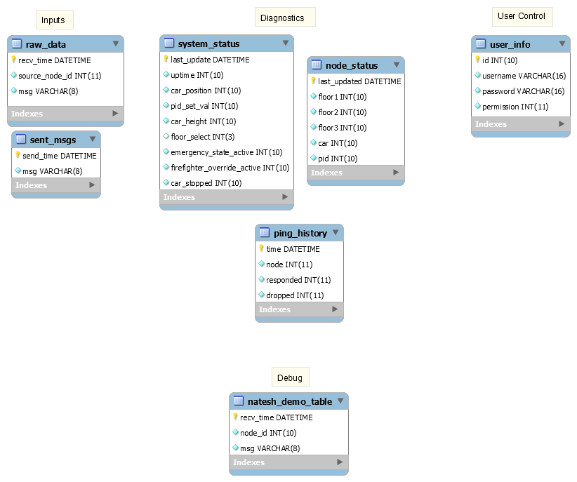

# DatabaseSchema
Database schema for data logging

Prerequisites
-------------
~~~~~~~~~~~~~~~~~~~~~~~~~~~~~~~~~~{.sh}
sudo apt-get install mysql-server
~~~~~~~~~~~~~~~~~~~~~~~~~~~~~~~~~~

Usage
-----
~~~~~~~~~~~~~~~~~~~~~~~~~~~~~~~~~~~~~~~~~~~~~~~~~{.sh}
mysql -u [user] -p [database name] < elevator_data_repository.sql
~~~~~~~~~~~~~~~~~~~~~~~~~~~~~~~~~~~~~~~~~~~~~~~~~

Tables
------

